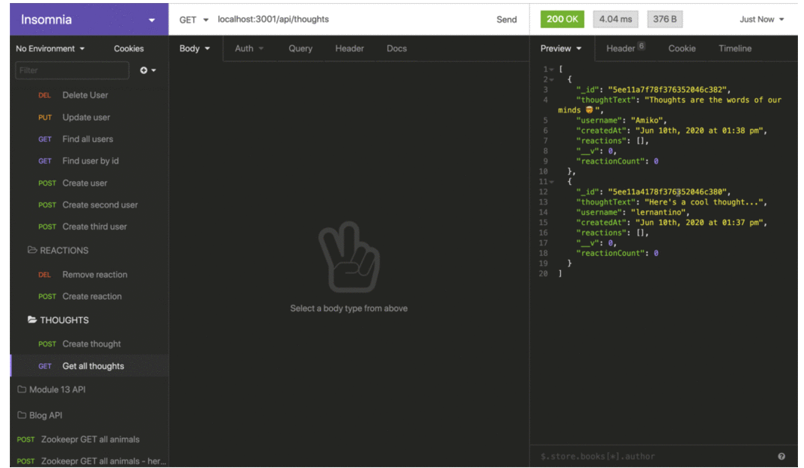

# Social Network

## User Story

 

AS A social media startup
I WANT an API for my social network that uses a NoSQL database
SO THAT my website can handle large amounts of unstructured data

# Acceptance Criteria

GIVEN a social network API
 

<ul>
<li>WHEN I enter the command to invoke the application</li>
<li>THEN my server is started and the Mongoose models are synced to the MongoDB database</li>
<li>WHEN I open API GET routes in Insomnia for users and thoughts</li>
<li>THEN the data for each of these routes is displayed in a formatted JSON</li>
<li>WHEN I test API POST, PUT, and DELETE routes in Insomnia</li>
<li>THEN I am able to successfully create, update, and delete users and thoughts in my database</li>
<li>WHEN I test API POST and DELETE routes in Insomnia</li>
<li>THEN I am able to successfully create and delete reactions to thoughts and add and remove friends to a user's friend list</li>
</ul>

[Video Tutorial](https://drive.google.com/file/d/1BdsxFYIC4PAqgC-h5M4ndpeDrrL123jS/view)

Contribution guidelines for this project

